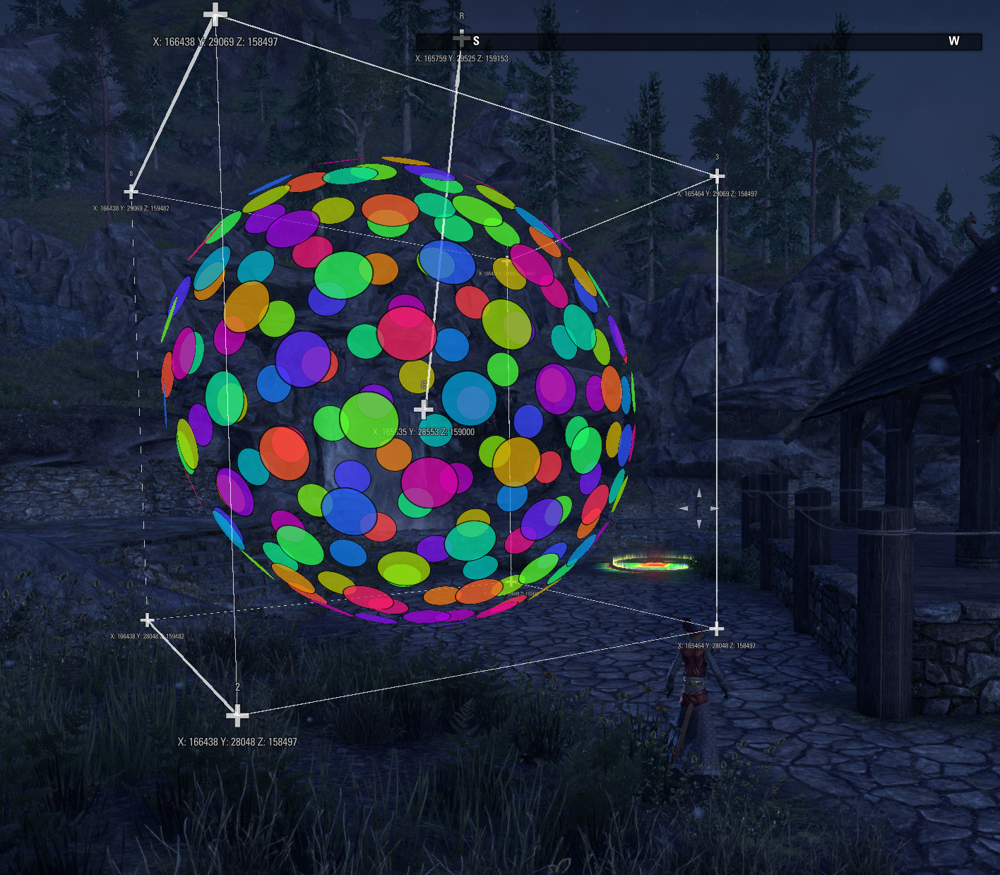
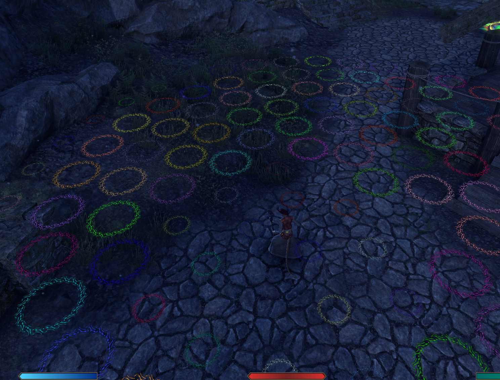
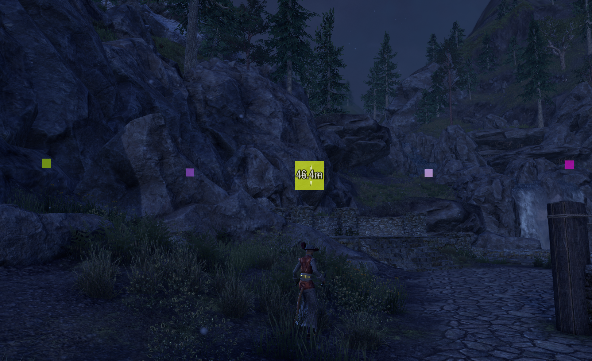
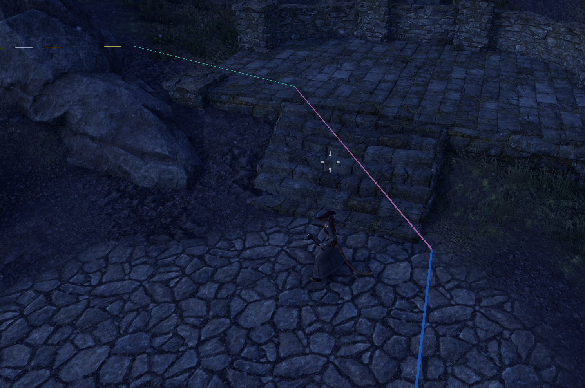
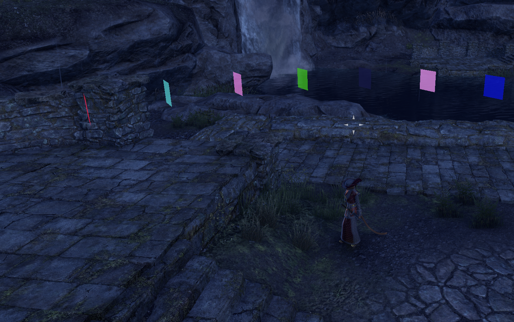
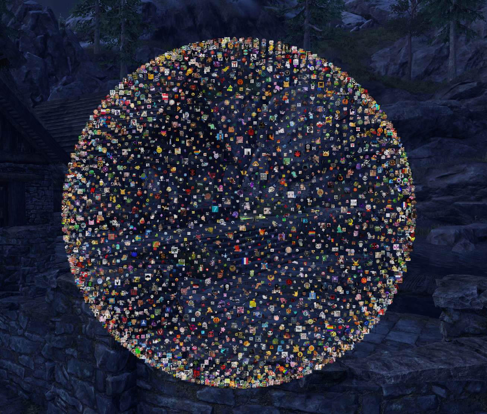
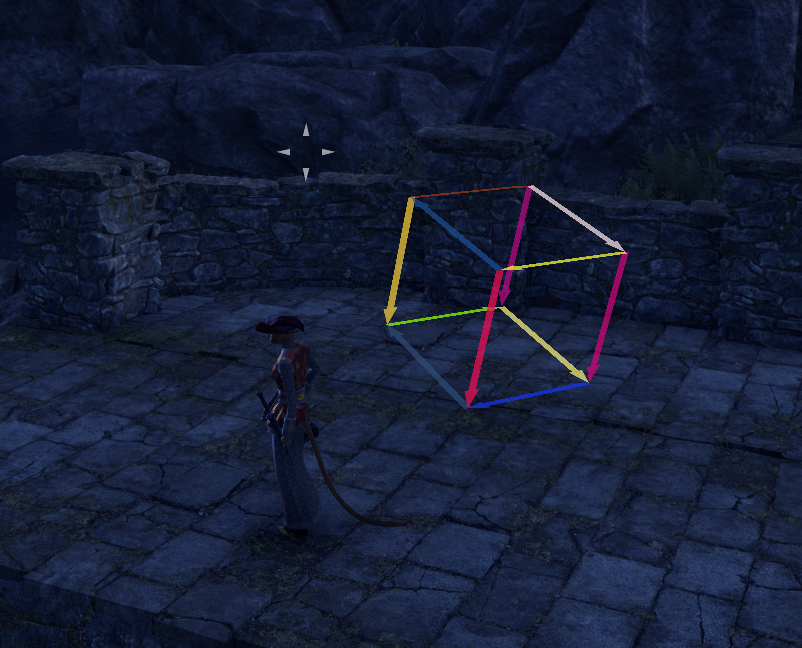

# Lib3DObjects

A library for **The Elder Scrolls Online (ESO)** that helps addons create and manipulate **3D objects** in the game world.  
The goal is a small, easy to use API with lots of room for customization (appearance, transforms, behavior, etc.).

> Note: This library is under active development. Expect changes.

Projects using / built around Lib3DObjects:

- [Lib3DObjectsExamples](https://github.com/m00nyONE/Lib3DObjectsExamples)
- [Lib3DObjectsTextures](https://github.com/m00nyONE/Lib3DObjectsTextures)
- [GroupSupportIcons](https://github.com/m00nyONE/GroupSupportIcons)
- [L3DO-m00MarkerPack](https://github.com/m00nyONE/l3do-m00MarkerPack)

## Motivation

- There is no maintained “standard” 3D library for ESO. Many addons end up being used as de-facto libraries (e.g. OdySupportIcons), which is not ideal.
- I wanted to learn more about 3D programming and the math behind it.
- This should also act as documentation/reference for other developers.

## Usage of AI

- The code is written by hand (not AI-generated). I used AI primarily for autocompletion.
- The documentation was partially generated with the help of AI (e.g. function descriptions, usage examples), based on my own explanations and code comments.

## Core Concepts
Lib3DObjects is build to be extensible and easy to use. It provides several base classes that can be extended to create custom 3D objects with specific behaviors. 
There are a lot of premade Objects that can be used directly or extended.

There are two Base types that all 3D objects derive from:
- **BaseObject**: The base class for all 3D objects. It provides basic functionality such as position, rotation, scale, callbacks, and visibility.
- **BaseObjectGroup**: A container for multiple BaseObjects. It allows for collective transformations and management of its child objects.

With these base classes, you can create various types of 3D objects, such as:
- **Point**: A simple point in 3D space.
- **Arrow**: An arrow that can be used to indicate direction in 3D space.
- **Text**: 3D text that can be placed in the game world.
- **Texture**: A 2D texture that can be placed in 3D space.
- **Marker**: A marker that can be placed in 3D space, with options for different textures, animations, text and custom behaviours.
- **Line**: A line segment between two points in 3D space.

Callbacks can be registered to objects to update their properties dynamically, e.g. to make them follow a player or rotate over time. This also allows for creating reactive objects that change based on player actions or game events.
There are several premade animation that can be used to animate objects, e.g. spinning, bouncing, pulsing, etc.

Renderers are used to define how objects are drawn in the game world. Different renderers can be used for different types of objects, allowing for customization of appearance and behavior. The currently available renderers are:
- **WorldSpaceRenderer**: Renders objects in the 3D world over everything else. It allows you to see the objects through obstacles. This is the default renderer for most objects. With this you can render EVERY Control in 3D Space.
- **RenderSpaceRenderer**: Renders objects in render space, allowing them to use a depth buffer and be occluded by world geometry. This is useful for creating objects that interact with the environment more realistically. This renderer ONLY supports TextureControls. That's just a limitation of the ESO API.

## Documentation
The full indepth documentation to every aspect of the library and its components can be found in the corresponding folders:
- [Core](./core/README.md)
- [Utils](./util/README.md)
- [Renderers](./renderer/README.md)
- [Objects](./objects/README.md)
- [ObjectGroups](./objectGroups/README.md)
- [Animations](./animations/README.md)

## Demo

Screenshots of some things built using this library:


*A 3D Sphere built out of 150 Texture circles that rotates around a Point in 3D space*


*Rotating Ground markers that change their size when close to the player*


*Reactive Floating Markers that change their size and display text when hovering the crosshair over them*


*Lines drawn on the floor to indicate a zone*


*an array of UnitMarkers around the player which always face in the players heading direction*


*A cloud of 2000 icons from LibCustomIcons*


*A rotating cube made out of 12 arrows*

A Demo Video will come soon... TM
## Usage

There are a LOT more examples in my Lib3DObjectsExamples addon (linked above).

Minimal example: **create a marker that follows you**.

```lua

local addon_name = "l3doExampleAddon"
local l3do = Lib3DObjects
local EM = GetEventManager()

local function initialize()
    local texture = "/esoui/art/icons/sunspiresenche.dds" -- replace with your texture
    local unitTag = "player" -- or "group1", "group2" etc.
    local myMarker = l3do.UnitMarker:New(texture, unitTag) 
end

EM:RegisterForEvent(addon_name, EVENT_ADD_ON_LOADED, function(_, name)
    if name ~= addon_name then return end
    
    EM:UnregisterForEvent(addon_name, EVENT_ADD_ON_LOADED)
    initialize()
end)
```

## Contributing

Feel free to open issues and create Pull Requests.
